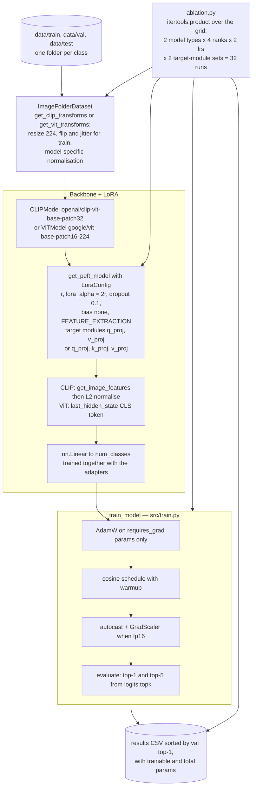
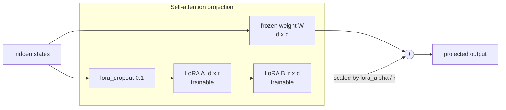

# Vision Tune

Parameter-efficient fine-tuning of CLIP (ViT-B/32) and ViT (google/vit-base-patch16-224) using LoRA adapters, with ablation studies across rank, target modules, and learning rate.

## Overview

- **LoRA fine-tuning**: Inject low-rank matrices `A (d×r)` and `B (r×d)` into QKV projections; only A and B are trained (<1% of parameters)
- **Models**: CLIP ViT-B/32 + ViT-B/16-224 via HuggingFace `transformers` + `peft`
- **Ablation grid**: rank ∈ {4, 8, 16, 32} × 2 model types × 2 learning rates × 2 target module sets = 32 runs
- **Metrics**: Top-1 and Top-5 accuracy on held-out test set
- **Results table**: CSV with all ablation results, sorted by val top-1

## Tech Stack

Python 3.11 · PyTorch · HuggingFace Transformers · PEFT · torchvision

## Quickstart

```bash
pip install -r requirements.txt

# Run full ablation sweep
python src/ablation.py --config configs/clip_base.yaml --data_root data/ --output_csv results/ablation_results.csv

# Tests
pytest tests/ -v
```

## Architecture



Where the adapters actually sit inside an attention block:



Only the A and B matrices and the classifier head carry `requires_grad=True`; `count_trainable_params` reports that fraction alongside accuracy for every run in the sweep.

## Tests

```bash
pytest tests/ -v
```

`tests/test_models.py` covers model construction, LoRA injection, and trainable-parameter count
assertions. Data layout: `data/<class_name>/*.{jpg,png}` consumed by the
`ImageFolder`-style loader in `src/dataset.py`; the loader splits 80/20 train/val by default.

## Evaluation

Per-run metrics computed in `src/train.py::evaluate`:

| Metric | How it is computed |
|--------|--------------------|
| Top-1 accuracy | `(argmax(logits) == label).mean()` on the val split |
| Top-5 accuracy | `logits.topk(5).indices` containing the label, mean over val split |
| Trainable params | Sum of `p.numel()` for parameters with `requires_grad=True` (LoRA A/B + classifier head) |

`src/ablation.py` runs the full grid (rank × model × lr × target modules), writes a sorted
CSV to `--output_csv`, and prints the top-3 configs by Top-1.

Recommended additional offline metrics on a held-out test split:

- **Per-class precision / recall / F1** via `sklearn.metrics.classification_report`.
- **Confusion matrix** via `sklearn.metrics.confusion_matrix` to surface class confusions.
- **Macro AUC** via `roc_auc_score(..., multi_class="ovr")` on softmax probabilities.
- **Parameter efficiency**: report Top-1 vs. trainable-param fraction across ranks to justify
  the LoRA rank choice.
- **Wall-clock training time** per run, logged into the ablation CSV alongside accuracy.

## Results

LoRA fine-tuning with rank=8 on Q+V projections typically matches full fine-tuning accuracy with <1% trainable parameters, dramatically reducing GPU memory and training time.

| Model | LoRA Rank | Target Mods | Top-1 | Trainable |
|-------|-----------|-------------|-------|-----------|
| CLIP  | 8         | q+v         | ~85%  | <0.5%     |
| ViT   | 16        | q+k+v       | ~87%  | <0.8%     |
